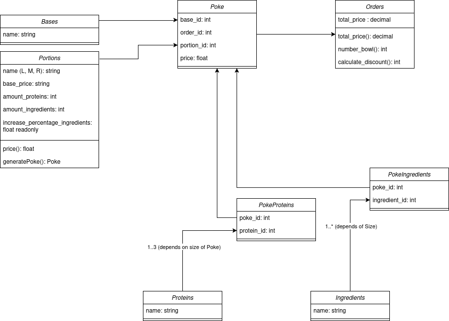

# Exam #3: "Poke"

## Students

- s347522 MANTZARIDES GUILLAUME
- s343715 KHUDOYBERDIEV AZAMKHON
  
## React Client Application Routes

- Route `/`: home page where the visitors can browse the availability of the pokebowl, once logged, can see all their past orders and create new ones.
- Route `/login`: login page

## API Server

### APIs to handle option for Pokebowl creation

- GET `/assets/bases`
  - description: System API to get all bases, in order to show them as options to the user
  - request body content: Empty
  - response body content: 
  ```json
  [
    {
      "id": 1,
      "name": "rice"
    },
    {
      "id": 2,
      "name": "black rice"
    },
    {
      "id": 3,
      "name": "salad"
    }
  ]
  ```

- GET `/assets/ingredients`
  - description: System API to get all ingredients, in order to show them as options to the user
  - request body content: Empty
  - response body content: 
  ```json
  [
    {
      "id": 1,
      "name": "avocado"
    },
    {
      "id": 2,
      "name": "ananas"
    },
    {
      "id": 3,
      "name": "cashew nuts"
    },
    {
      "id": 4,
      "name": "kale"
    },
    {
      "id": 5,
      "name": "peppers"
    },
    {
      "id": 6,
      "name": "corn"
    },
    {
      "id": 7,
      "name": "wakame"
    },
    {
      "id": 8,
      "name": "tomatoes"
    },
    {
      "id": 9,
      "name": "carrots"
    },
    {
      "id": 10,
      "name": "salad"
    }
  ]
  ```

- GET `/assets/portions`
  - description: System API to get all portions, in order to show them as options to the user
  - request body content: Empty
  - response body content: 
  ```json
  [
    {
      "name": "R",
      "id": 1,
      "base_price": 9,
      "amount_proteins": 1,
      "amount_ingredients": 4,
      "increase_percentage_ingredients": 20
    },
    {
      "name": "M",
      "id": 2,
      "base_price": 11,
      "amount_proteins": 2,
      "amount_ingredients": 4,
      "increase_percentage_ingredients": 20
    },
    {
      "name": "L",
      "id": 3,
      "base_price": 14,
      "amount_proteins": 3,
      "amount_ingredients": 6,
      "increase_percentage_ingredients": 20
    }
  ]
  ```

- GET `/assets/proteins`
  - description: System API to get all proteins, in order to show them as options to the user
  - request body content: Empty
  - response body content: 
  ```json
  [
    {
      "name": "tuna",
      "id": 1
    },
    {
      "name": "chicken",
      "id": 2
    },
    {
      "name": "salmon",
      "id": 3
    },
    {
      "name": "tofu",
      "id": 4
    }
  ]
  ```
### APIs to manage Orders


- GET `/orders`
  - description: User API to show the list of all of their order
  - request body content: Empty
  - response body content: 
  ```json
  ############################## TO DO
  ```

- POST `/order`
  - description: User API to create an order base on existing poke bowls
  - request body content:
  ```json
  ############################## TO DO
  ```
  - response body content: 
  ```json
  {
  "id": [Id of inserted order]
  }
  ```

### APIs to manage Pokebowls

- POST `/poke`
  - description: User API to create a noew pokebowl and check if parameters are correct
  - request body content:
  ```json
  {
    "base_id": 1,
    "price": 9,
    "ingredient_ids": [
      1
    ],
    "portion_id": 1,
    "protein_ids": [
      2
    ]
  }
  ```
  - response body content: 
  ```json
  {
    "id": [Id of inserted Pokebowl]
  }
  ```

- PUT `/poke/:id`
  - description: User API to update any parameter of an existing pokebowl
  - request body content:
  ```json
  ############################## TO DO
  ```
  - response body content: 
  ```json
  "Poke bowl updated"
  ```

## Overview of entities in project



## Database Tables

- Table `Bases`:  
  - stores the information of the bases available in the poke bowl
  - contains id, name
- Table `Ingredients`:  
  - stores the information of the ingredients available in the poke bowl
  - contains id, name
- Table `Orders`:  
  - stores the information of the orders created by users
  - contains id, total_price
- Table `Poke`:  
  - stores the information of the poke bowl created by users
  - contains id, price, base_id, order_id, portion_id
- Table `PokeIngredients`:  
  - stores the information of the ingredients used in the poke bowl
  - contains id, poke_id, ingredient_id
- Table `PokeProteins`:  
  - stores the information of the proteins available in the poke bowl
  - contains id, poke_id, protein_id
- Table `Portions`:  
  - stores the information of the portions available for poke bowls
  - contains id, name, base_price, amount_proteins, amount_ingredients,increase_percentage_ingredients
- Table `Proteins`:  
  - stores the information of the proteins used in the poke bowl
  - contains id, name

## Main React Components

- `Component` in `file.jsx` is ...;


## Screenshot


## Users Credentials

| Username (e-mail) | Password | IDs of his/her order |
| :------------- |:-------------| :-------------|
|	a.b@example.com | password | X, Y |
|	a.b@example.com | password | X, Y |
| a.b@example.com | password | X, Y |