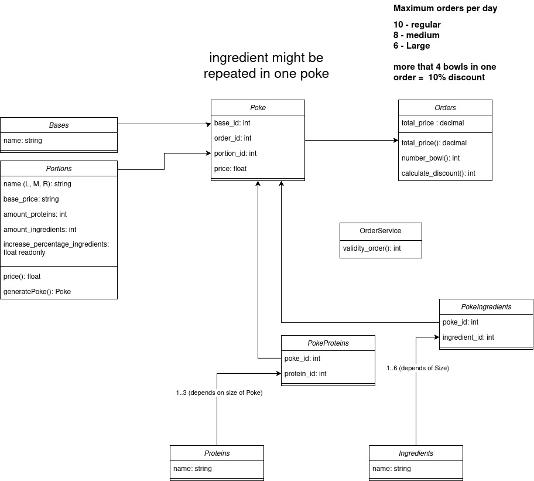

# Group "LAZY FOLLOWERS"

## Members

- s347522 MANTZARIDES GUILLAUME
- s343715 KHUDOYBERDIEV AZAMKHON

## Exercise "POKE"

## Lab Journal

(you may update this file to keep track of the progress of your group work, throughout the weeks)

## Overview of entities in project



## Setup

Follow these steps to set up and run the project locally:

1. Install dependencies:

   ```sh
   npm install
   ```

2. If you do not have `nodemon` installed globally, install it:

   ```sh
   npm install -g nodemon
   ```

3. Run the project:

   ```sh
   npm start
   ```

   Or for local development with `nodemon`:

   ```sh
   nodemon backend.js
   ```

4. Access the REST API documentation at:
   [http://localhost:3000/api-docs](http://localhost:3000/api-docs)

## License

This project is licensed under the MIT License.
